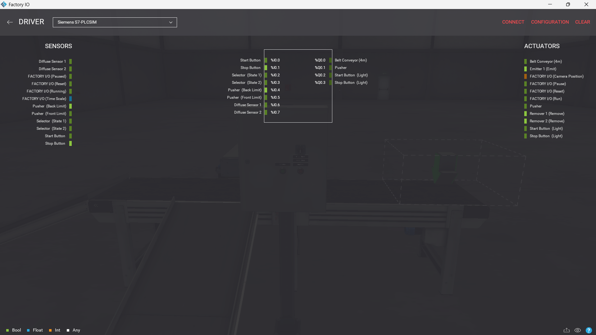
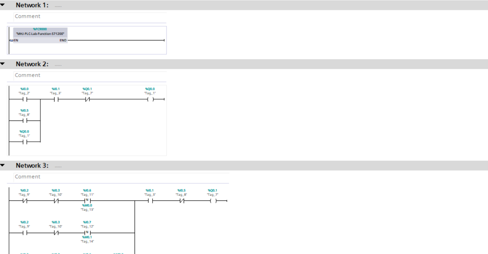
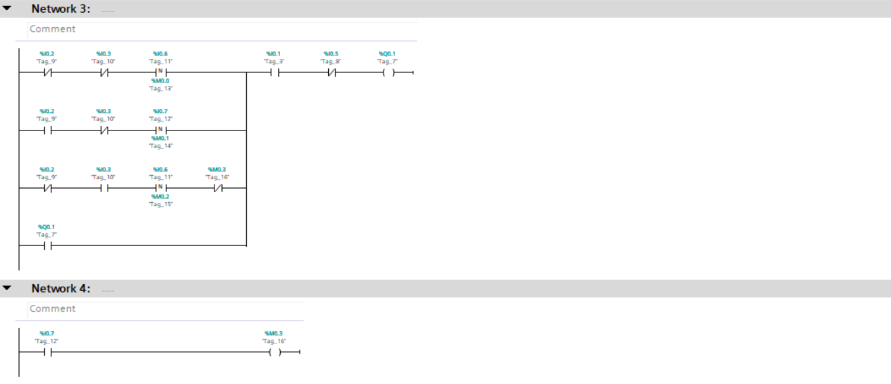
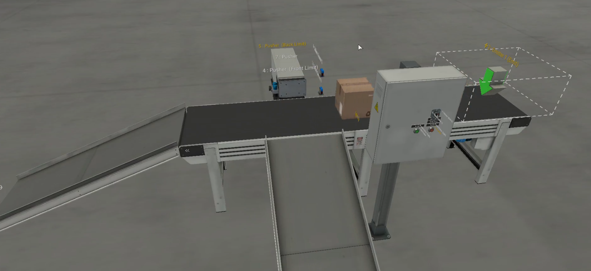

# PLC-MultiMode-Pusher-System
# Multi-Mode Industrial Pusher & Sorting System (TIA Portal & Factory I/O)

## 📌 Project Overview
This project demonstrates a flexible industrial automation system featuring a conveyor, pneumatic pusher, and a 3-position selector switch.  

The system supports multiple operation modes, allowing dynamic control strategies ranging from manual operation to fully automated sorting based on real-time sensor feedback.

---

## 🛠️ Technologies Used
- **PLC Programming:** Siemens TIA Portal (S7-1200)
- **Simulation:** Factory I/O
- **PLC Simulation:** Siemens S7-PLCSIM
- **Programming Language:** Ladder Diagram (LAD)

---

## ⚙️ Operating Modes
The system behavior is controlled using a **3-position selector switch**, where each mode defines a different sorting strategy:

- **Mode 1 (State 1): Full Sorting (All Items)**
  - The pusher is activated for **all detected boxes**
  - Both large and small items are diverted
  - Used for full discharge or system testing

- **Mode 2 (Neutral State): Large Items Sorting**
  - The pusher is triggered **only for large boxes**
  - Small boxes continue on the conveyor without interaction
  - Sorting decision based on diffuse sensor detection logic

- **Mode 3 (State 2): Small Items Sorting**
  - The pusher is triggered **only for small boxes**
  - Large boxes are allowed to pass
  - Provides selective sorting based on product type.
---

## 📸 Project Preview

### 🔹 Driver & I/O Configuration

### 🔹 Ladder Logic Implementation
  

### 🔹 Factory I/O Scene

---

## 🎥 Demo Video
👉 [Watch the system in action](video.mp4)

---

## 📂 Project Files Included
- TIA Portal Project File  
- Factory I/O Scene File  
- PLC Logic Screenshots  
- Full Simulation Video  

---

## 🚀 How to Run the Project
1. Open the project in **TIA Portal**
2. Start **S7-PLCSIM**
3. Open the scene in **Factory I/O**
4. Connect using `S7-PLCSIM Driver` (ensure status is green)
5. Select operation mode using the **Selector Switch**
6. Press **Start** to run the system

---

## 💡 Engineering Notes
- System designed with modular and scalable logic structure  
- Clear separation between manual and automatic control paths  
- Reliable operation ensured using feedback-based actuation  
- Suitable for real industrial adaptation with minor modifications  
